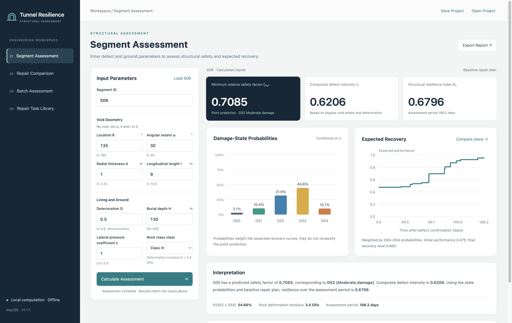

# Tunnel Structural Resilience Assessment

English-language software and supporting datasets for assessing tunnel structural resilience under combined voids behind the lining and lining material deterioration.

The application links a saved LightGBM safety-factor predictor, a fragility model and task-level recovery curves. It calculates structural performance loss and subsequent recovery over a common assessment period, and compares repair plans.



## Quick start

Download and extract this repository, then open **[index.html](index.html)** in a modern browser. The application runs locally without a server, Python or model training. Keep the JavaScript and CSS files together with `index.html`.

For the Electron desktop interface, install Node.js and npm, then run in the repository directory:

```sh
npm install
npm start
```

Installing Electron requires an internet connection. Application calculations run on the local device; the application has no analytics or upload service. The desktop interface was checked on an Apple silicon Mac. The Electron dependency is pinned to the version used for that check.

## Data downloads

| Workbook | Contents |
| --- | --- |
| [600组数据.xlsx](600组数据.xlsx) | 600 numerical cases. Use the **原始数据** worksheet for the eight input variables and reference minimum relative safety factor. |
| [预测数据_9400组_最新.xlsx](预测数据_9400组_最新.xlsx) | 9,400 additional scenario inputs, saved LightGBM predictions, composite defect intensity and normalised predictions. |

The two workbooks are retained exactly as supplied. Together, the 600 reference cases and 9,400 predictions form the 10,000-case analysis dataset. They are distinct data sources; the additional 9,400 responses are surrogate predictions.

**Version note:** the 600-case workbook also contains historical derived worksheets. Its `η与损伤状态` worksheet uses earlier intensity values. Use the raw input worksheet and the current application coefficients when reproducing the present analysis. See [DATA.md](DATA.md) for sheet descriptions, units, normalisation and verification results.

## Application functions

- **Segment Assessment:** enter the defect and ground parameters, choose rock mass class I–V and calculate safety, damage-state probabilities and resilience.
- **Repair Comparison:** adjust waiting times, stage durations, task links, gain weights and final recovery levels. Baseline and adjusted plans are compared over the same assessment period.
- **Batch Assessment:** load the 20 included case-study inputs or import a CSV file, then export assessment results.
- **Repair Task Library:** add or modify tasks and their reference durations, and import or export task libraries.

The example files are [inspection-segments.csv](inspection-segments.csv) and [S06_baseline_project.json](S06_baseline_project.json). Use **Open Project** to load the JSON example. These examples contain assessment inputs and settings; they are not original engineering inspection reports.

## Input variables

| Input | Symbol | Supported range |
| --- | --- | --- |
| Void location | θ | 0–180° |
| Circumferential angular extent | ω | 0–50° |
| Radial thickness | d | 0–2.25 m |
| Longitudinal length | l | 0–13.5 m |
| Lining deterioration degree | D | 0–0.8 |
| Burial depth | H | 50–450 m |
| Lateral pressure coefficient | λ | 0.5–2.5 |
| Rock mass class, encoded by deformation modulus | E | I: 34; II: 26.5; III: 12; IV: 3.4; V: 1.0 GPa |

For an existing void, ω, d and l must all be positive. For no void, set all three to zero. The output ζmin is the minimum relative safety factor on its original, dimensionless scale.

The CSV import format is:

```text
id,theta,omega,d,l,D,H,lambda,rock_class
```

Use UTF-8, unique segment IDs and rock classes `I`, `II`, `III`, `IV` or `V`. The interactive importer accepts up to 5,000 rows and 5 MB per file. The accompanying research workbooks are download datasets; the interface does not import Excel files directly.

## Recovery calculations

Stages run sequentially in the displayed order. A stage can contain several tasks. Its completion produces a performance increment equal to its normalised gain weight multiplied by the difference between final and initial performance. Stages without a direct structural performance gain can have zero weight.

**Update Durations from Library** sums the reference durations of linked tasks. For parallel tasks within a stage, enter the effective duration justified by task dependencies and available resources. Final recovery levels can be set between the state's initial performance and 1.0.

The existing **DS3 Duration Example** removes R9 and shortens the grouting stage by 16.3 days while retaining the gain weights and final recovery level. It illustrates a conditional schedule change under equal repair effectiveness; it is not an automatically selected optimum or a field-verified alternative.

**Save Project** and **Open Project** transfer settings, task libraries and plans as JSON. Results can be exported as CSV, SVG and printable HTML. Applied settings are also saved locally in the browser or desktop profile.

## Model and verification

The application contains the saved seed-42 LightGBM model with 900 trees. The eight-input prediction model uses rock class V at E = 1.0 GPa. No training or parameter changes were performed when preparing this repository.

The point damage-state classification uses the predicted safety factor. Damage-state probabilities are conditional on composite defect intensity η and are used to weight recovery curves. They are different outputs and do not directly represent routine inspection condition ratings.

[release-verification.json](release-verification.json) records the comparison between application predictions and all 9,400 workbook predictions. [english-edition-verification.json](english-edition-verification.json) records the earlier numerical and interface checks of the English edition. [checksums.json](checksums.json) lists file hashes for this distribution.

The repository provides the saved inference model and assessment application. It does not include FLAC3D simulation files or the full surrogate-training pipeline.
